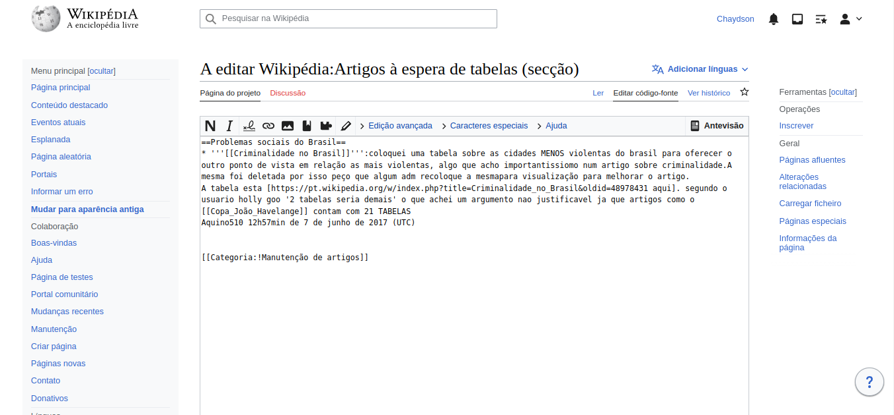

# Guia de Estilo

## Introdução

Segundo Simone (2021): "É comum, principalmente em projetos grandes, reunir os princípios e as diretrizes adotados em um documento intitulado guia de estilo. Trata-se de um registro das principais decisões de design tomadas, de forma que elas não se percam, isto é, sejam efetivamente incorporadas no produto final. Guias de estilo servem de ferramenta de comunicação entre os membros da equipe de design e também com a equipe de desenvolvimento. É importante que as decisões de design possam ser facilmente consultadas e reutilizadas nas discussões sobre extensões ou versões futuras do produto".

## Metodologia

Um guia de estilo deve incorporar decisões de design envolvendo os principais elementos e considerações
de design de interface. Marcus (1991) considera os seguintes elementos:

- layout: proporção e grids; uso de metáforas espaciais; design gráfico de exibidores e ferramentas;
- tipografia e seu uso em diálogos, formulários e relatórios;
- simbolismo: clareza e consistência no design de ícones;
- cores: os dez mandamentos sobre o uso de cores;
- visualização de informação: design de gráficos, diagramas e mapas;
- design de telas e elementos de interface (widgets).

## Introdução

### Objetivo

Seu objetivo é reunir e registrar as principais decisões de design tomadas durante o processo de desenvolvimento, garantindo que elas não sejam perdidas e possam ser facilmente acessíveis para a implementação no produto final e reutilização em futuras etapas de extensão do produto.

Além disso, o Guia de Estilo também tem como objetivo facilitar a comunicação e o alinhamento entre as equipes de design e desenvolvimento. Ele fornece uma referência clara e consistente para o estilo visual, a tipografia, as cores, os elementos de interface e outros aspectos visuais e funcionais do projeto. Isso ajuda a garantir que a equipe de desenvolvimento implemente as decisões de design de forma consistente e coerente, o que é especialmente importante em projetos complexos e colaborativos.

Outro objetivo importante do Guia de Estilo é melhorar a usabilidade do produto final. O guia pode incluir diretrizes específicas para a interface do usuário, como a organização dos elementos da tela, a forma como o usuário navega pelo site e o feedback do usuário. Ao garantir que o design e a funcionalidade do produto sejam intuitivos e fáceis de usar, o Guia de Estilo pode ajudar a melhorar a experiência do usuário e a aumentar a satisfação e a retenção do cliente.

Por fim, o Guia de Estilo pode ser uma ferramenta valiosa para manter a consistência da marca e a identidade visual do produto. Ele pode incluir diretrizes para o uso da marca, como a cor e a tipografia da logomarca, garantindo que o produto final reflita a identidade da marca de forma consistente e coerente.

### Organização e conteúdo do guia de estilo

1. Introdução (com Objetivo do guia de estilo, Organização e conteúdo do guia de estilo, Público alvo do guia de estilos (programadores, gerentes, equipe de suporte), Como utilizar o guia (em produção e manutenção), Como manter o guia.
2. Resultados de análise • Descrição do ambiente de trabalho do usuário
3. Elementos de interface • Disposição espacial e grid • Janelas • Tipografia • Cores
4. Elementos de interação • Estilos de interação • Seleção de um estilo • Aceleradores (teclas de atalho)
5. Elementos de ação • Preenchimento de campos • Seleção • Ativação
6. Vocabulário e padrões • Terminologia • Tipos de tela (para tarefas comuns) • Sequências de diálogos (e.g., para feedback ou confirmação de uma operação)

### Público-alvo do guia de estilos (programadores, gerentes, equipe de suporte)

O público-alvo do Guia de Estilo são as equipes envolvidas no desenvolvimento do projeto, incluindo designers, desenvolvedores, gerentes de projeto e outros profissionais que trabalham no produto. O guia fornece diretrizes claras e consistentes para a implementação das decisões de design, garantindo que a equipe trabalhe de forma alinhada e eficiente. Além disso, o Guia de Estilo pode ser usado como uma referência para futuros desenvolvimentos e para garantir que a identidade visual e a marca do produto sejam mantidas consistentes em todas as plataformas e canais.

### Como utilizar o guia de estilo

O Guia de Estilo é uma ferramenta essencial para orientar o processo de design e desenvolvimento de um projeto, garantindo consistência e facilitando a comunicação entre as equipes envolvidas. Aqui estão algumas orientações sobre como utilizar o Guia de Estilo de forma efetiva:

1 - Durante a produção:

- Ao iniciar um projeto, familiarize-se com o Guia de Estilo. Leia cuidadosamente a introdução, que descreve os objetivos e a organização do guia, e entenda as principais decisões de design já tomadas.

- Utilize o guia como uma referência constante durante o processo de design e desenvolvimento. Consulte as diretrizes visuais, como tipografia, cores e elementos de interface, para garantir a consistência em todo o projeto.

- Ao criar novas telas ou funcionalidades, verifique se elas estão alinhadas com as diretrizes estabelecidas no Guia de Estilo. Isso ajudará a garantir a coerência visual e a usabilidade do produto final.

2 - Durante a manutenção:

- Mantenha o Guia de Estilo atualizado. À medida que novas decisões de design forem tomadas ou alterações forem feitas na identidade visual ou nas diretrizes de marca, documente-as no guia.

- Certifique-se de que todas as equipes envolvidas no projeto estejam cientes da existência do Guia de Estilo e saibam como acessá-lo. Promova a conscientização sobre a importância de seguir as diretrizes estabelecidas para garantir a consistência e a qualidade do produto.

- Realize revisões periódicas do Guia de Estilo com a equipe de desenvolvimento para garantir que ele esteja sendo seguido corretamente. Isso ajudará a identificar e corrigir possíveis desvios e garantir a conformidade com as decisões de design estabelecidas.

3 - Como utilizar o guia:

- O Guia de Estilo pode ser utilizado como uma fonte de referência para a implementação de novos elementos de interface, estilos de interação, ações e padrões de vocabulário. Consulte-o sempre que surgirem dúvidas sobre a maneira correta de implementar determinados elementos ou interações.

- Use o Guia de Estilo como um meio de comunicação efetivo entre as equipes de design e desenvolvimento. Ao seguir as diretrizes estabelecidas no guia, a comunicação e o alinhamento entre as equipes serão facilitados, evitando retrabalhos e garantindo a consistência do produto.

- Não hesite em atualizar o Guia de Estilo com base no feedback dos usuários e nas lições aprendidas ao longo do desenvolvimento. O guia deve ser um documento vivo, adaptável e aprimorado continuamente para atender às necessidades do projeto.

Seguindo essas orientações, você poderá utilizar o Guia de Estilo de forma eficiente, garantindo a consistência do design, a usabilidade do produto final e uma comunicação eficaz entre as equipes envolvidas no projeto.

### Como manter o guia

Para manter a eficácia do Guia de Estilo, é importante atualizá-lo regularmente com novas decisões de design e mudanças na identidade visual ou nas diretrizes de marca. A equipe de design deve garantir que todas as mudanças e atualizações sejam documentadas no Guia de Estilo e que as informações estejam sempre acessíveis e atualizadas. Além disso, é importante educar e conscientizar a equipe de desenvolvimento sobre o uso e a importância do Guia de Estilo, garantindo que ele seja seguido de forma consistente em todas as etapas do projeto. Ao manter o Guia de Estilo atualizado e fazer com que a equipe de desenvolvimento o siga adequadamente, é possível garantir a consistência do design e da identidade visual do produto, melhorar a eficácia da equipe e a satisfação do cliente.

## Resultados de análise

### Descrição de ambiente de trabalho do usuário

O objetivo do usuário ao acessar a Wikipedia é obter informações de forma clara e objetiva. Por isso, é importante que o site apresente um layout simples e organizado, para que o usuário possa encontrar facilmente o que está procurando. Além disso, é fundamental que o conteúdo dos artigos seja de fácil compreensão e apresentado de forma coerente, com informações precisas e confiáveis. É importante que os links para outras páginas da Wikipedia estejam disponíveis e facilmente acessíveis, para que o usuário possa aprofundar seus conhecimentos sobre o assunto que está pesquisando.

## Elementos de interface

### Disposição espacial e grid

O site possui um layout em que os elementos são divididos em sessões e estes são centralizados na página. A Figura 1 a seguir demonstra a disposição dos elementos da página principal e inicial do sistema.

    
 Figura 1: Layout (Fonte: Autores. 2023).

### Janelas

São diversas as janelas contidas no site, porém, pode-se destacar as principais, como a página inicial, a página de um artigo qualquer, e a página de edição de um artigo. As páginas citadas podem ser visualizadas na Figura 2, Figura 3 e Figura 4.

    
 Figura 2: Página de um artigo (Fonte: Wikipedia. 2023).

    
 Figura 3: Página inicial (Fonte: Wikipedia. 2023).

    
 Figura 4: Página de edição de um artigo (Fonte: Wikipedia. 2023).

### Tipografia

O site utiliza o Sans Serif (Figura 5) como família de fonte com tamanho de 16px.

    
 Figura 5: Tipografia do Sans serif (Fonte: Microsoft. 2023).

### Símbolos não tipográficos

### Cores

O site utiliza as cores azul e branco, como pode ser visto na Figura 6.

    
 Figura 6: Paleta de cores da wikipedia (Fonte: Autores. 2023).

### Animações

## Elementos de interação

### Estilos de interação

Na Wikipédia a interação com o usuário é feita por meio de hiperlinks e ícones que funcionam como pontes para outras páginas.

### Seleção de um estilo

Na Wikipédia foi optado por um estilo bem minimalista, pois dado a grande quantidade de telas e funcionalidades uma interface com muitas cores e elementos poderia deixaria a interface poluída.

### Aceleradores (teclas de atalho)

A Wikipédia possui um menu de acesso rápido para os principais tópicos pesquisados, por tanto podemos ver acesse acelerador na Figura 7.

    
 Figura 7: Acelerador (Fonte: Wikipédia. 2023).

## Elementos de ação

### Preenchimento de campos

Na Wikipédia o preenchimento de campos ocorre na maior parte da aplicação, pois o site se baseia principalmente na criação e edição de artigos de texto e campos de pesquisa.

### Seleção

Os elementos de seleção são mais raros, porém pode-se encontrar campos de seleção de datas e etiquetas em algumas funcionalidades da Wikipédia.

### Ativação

A ativação acontece por meio de hiperlinks e ícones.

## Vobabulário e padrões

### Terminologia

Editar: abre o editor de artigos

Ver histórico: exibe histórico de alterações do artigo

Línguas: escolha de idiomas

Ícone de pessoa: área de controle do perfil do usuário

Ícone de lista com estrela: páginas visitadas

Ícone de caixa aberta: notificações

Ícone de sino: Alertas

Ícone de marca páginas: gravar configurações de filtros atuais

### Tipos de tela (para tarefas comuns)

As principais telas da Wikipédia são as telas de leitura de artigo, a página inicial e a página de edição de artigos, que podem ser observadas, respectivamente, na Figura 8, Figura 9 e Figura 10.

    
 Figura 8: Página de leitura de artigo (Fonte: Wikipédia. 2023).

  

    
 Figura 9: Página inicial (Fonte: Wikipédia. 2023).

  

    
 Figura 10: Página de edição (Fonte: Wikipédia. 2023).

### Sequências de dialógos (para feedback ou confirmação de operação)

A Wikipédia não possui nenhum tipo de confirmação de operações e os feedbacks só são dados quando a ação foi completamente realizada.

## Conclusão

Não adianta fazer um guia de estilo e deixar ele de lado. Temos que mostrar para os outros designers e desenvolvedores que ele existe e é importante, ensinar como usar, facilitar o acesso ao documento ou a alguma parte dele e mudar a cultura de design e desenvolvimento da equipe. Também temos que ver o guia de estilo como uma ajuda para o trabalho e a criatividade, não como regras. Ou seja, um guia de estilo deve ser usado para pensar melhor o design, não para copiar soluções ou fórmulas.

## Bibliografia

Mayhew, Deborah J. (1999). The Usability Engineering Lifecycle: A Practitioner’s Handbook for User
Interface Design. Morgan Kaufmann, 1st edition edition.

Marcus, Aaron (1991). Graphic design for electronic documents and user interfaces. Association for
Computing Machinery, New York, NY, USA.

Barbosa, S. D. J.; Silva, B. S. da; Silveira, M. S.; Gasparini, I.; Darin, T.; Barbosa, G. D. J. (2021) Interação Humano-Computador e Experiência do usuário. Autopublicação. ISBN: 978-65-00-19677-1.

## Histórico de Versão

| Versão | Data       | Descrição                              | Autor(es)        | Revisor(es)      |
| ------ | ---------- | -------------------------------------- | ---------------- | ---------------- |
| 1.0    | 13/05/2023 | Criação do documento                   | Chaydson e Lucas | Gabriel e Samuel |
| 1.1    | 05/07/2023 | Colocando elementos do livro da Simone | Lucas e Chaydson | Gabriel e Samuel |
