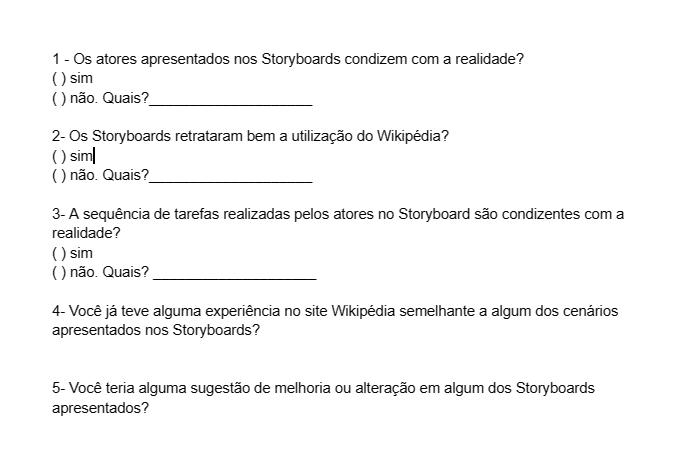

## Introdução

No contexto da engenharia de software, o storyboard é uma ferramenta visual fundamental para o planejamento, comunicação e visualização de interfaces de usuário, fluxos de trabalho e interações em sistemas ou aplicativos antes de sua implementação. Sua utilização permite que os profissionais de engenharia de software mapeiem os fluxos de trabalho, identifiquem problemas de usabilidade e tomem decisões embasadas sobre a interface e a experiência do usuário. Além disso, o storyboard serve como base para a criação de protótipos interativos e orienta a definição dos requisitos funcionais do software. Nesse sentido, o presente documento apresenta as avaliações e validações do usuário em relação aos storyboards, a fim de verificar o alinhamento e embasar as decisões do designer.

## Objetivos

O propósito deste documento consiste em estabelecer um planejamento para a avaliação do storyboard desenvolvido, levando em consideração a metodologia adotada e as tarefas realizadas. O objetivo principal é aprimorar as decisões do designer ao longo do projeto, além de obter informações valiosas para aperfeiçoar as funcionalidades presentes no sistema.

## Metodologia

O planejamento se baseará no uso do framework DECIDE e utilizará o método da entrevista. A combinação do framework DECIDE com o método da entrevista na avaliação oferece uma abordagem estruturada e eficiente. O DECIDE auxilia na definição de objetivos, identificação de questões-chave, seleção de métodos e análise de resultados. Por sua vez, as entrevistas aprofundam a compreensão dos participantes. Juntos, esses elementos fornecem informações valiosas para tomada de decisões informadas e para a busca da melhoria contínua.

## Planejamento da avaliação

### Recrutamento dos participantes

No contexto da atividade de [Perfil do Usuário](../../../analise-de-requisitos/perfilDeUsuario.md) e das [Personas](../../../analise-de-requisitos/personas.md), podemos identificar as qualidades necessárias para conduzir uma entrevista com um utilizador. Assim, iremos procurar por dois tipos de perfis: um menor de idade, com menos de 18 anos, e outro com idades entre 19 e 35 anos. Ambos os perfis utilizam a plataforma Wikipedia como fonte de conhecimento, seja para fins acadêmicos ou profissionais. Para realizar o recrutamento, empregamos grupos como meio de divulgação, visando atrair pessoas que se enquadrem nos perfis mencionados acima. Adicionalmente, convidamos conhecidos que se encaixam no perfil procurado. O nosso objetivo para esta avaliação é obter a participação de dois entrevistados.

### Cronograma da avaliação

A seguir, apresentamos a Tabela 1 com o cronograma da avaliação:

|    Data e horário    | Atividade                              | Autor(es)               | Revisor(es)             |
| :-------------------: | -------------------------------------- | ----------------------- | ----------------------- |
| 23/05/2023 às 21:00 | Executar teste piloto                  | Ana Luiza e Lucas Lopes | Chaydson e Pedro        |
| 24/05/2023 às 20:00 | Entrevistar os usuários               | Chaydson e Pedro        | Lucas Lopes e Ana Luiza |
| 26/05/2023 até 22:00 | Registrar os resultados da entrevista | Chaydson e Pedro        | Lucas Lopes e Ana Luiza |

    
 Tabela 1: Cronograma da avaliação. (Fonte: Autores. 2023).

### Papéis dos Avaliadores

Durante a entrevista com o usuário, um dos membros do grupo exercerá o papel de avaliador. Ele ficará responsável por observar os comportamentos, comunicação não verbal e respostas do entrevistado, enquanto conduz a entrevista. Terá mais um membro do grupo presente na avaliação que observará e, se necessário, auxiliará na entrevista. Esse segundo membro também será responsável por registrar as respostas do entrevistado.

### Roteiro de Perguntas

As perguntas apresentadas na Figura 1 comporão a entrevista com o usuário.

Figura 1: Roteiro de perguntas, versão 1.(Fonte: Autores. 2023).

### Teste Piloto

Antes de realizar a entrevista com o usuário será realizado um teste piloto. O teste piloto consiste em simular a entrevista com um membro do grupo. A partir desse teste será possível verificar se as perguntas abrangem o que é necessário para a avaliação e o tempo previsto para a entrevista. Qualquer mudança necessária será feita antes de realizar a entrevista.

## Questões Éticas

Ao realizar avaliações que envolvem a participação de indivíduos, é imprescindível obter o consentimento dos mesmos por meio de um Termo de Consentimento Livre e Esclarecido, em conformidade com os princípios éticos estabelecidos para o projeto.

### Termo de Consentimento

A seguir, encontra-se o Termo de Consentimento que será assinado antes da realização da entrevista, como parte do processo necessário para obter a permissão do participante.

[Termo de consentimento](../../../pdfs/termoConsentimentoStoryBoard.pdf)

## Bibliografia

BARBOSA, Simone; DINIZ, Bruno. Interação Humano-Computador. Editora Elsevier, Rio de Janeiro, 2010.

Lichess. Disponível em: [https://interacao-humano-computador.github.io/2022.2-Lichess/](https://interacao-humano-computador.github.io/2022.2-Lichess/). Acesso em: 16 maio. 2023.‌

## Histórico de Versão

| Versão | Data       | Descrição            | Autor(es)   | Revisor(es)      |
| ------- | ---------- | ---------------------- | ----------- | ---------------- |
| 1.0     | 16/05/2023 | Criação do documento | Pedro e Ana | Chaydson e Pedro |
