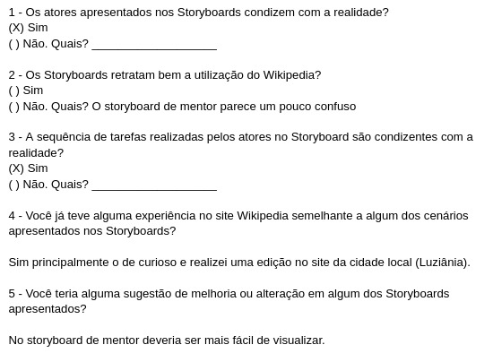

# Relato de Resultados da Avaliação do Storyboard

## Introdução

O relatório dos resultados da avaliação do "StoryBoard" é um artefato importante que tem o propósito de documentar minuciosamente os resultados obtidos através de uma avaliação meticulosa. O presente documento apresenta detalhadamente o relato de desempenho da avaliação dos "Storyboards", fornecendo informações substanciais sobre os resultados alcançados durante o processo.

### Objetivos da Avaliação

A avaliação dos Storyboards tem como objetivo verificar se as tarefas representadas em cada storyboard correspondem à experiência que o usuário tem durante sua rotina na plataforma Wikipedia. Além disso, busca-se analisar as áreas que podem ser aprimoradas e as críticas feitas pelos usuários, visando aperfeiçoar os storyboards.

- Coletar percepções e opiniões sobre a usabilidade e a experiência do usuário.
- Identificar pontos problemáticos, dificuldades ou ambiguidades.
- Compreender o entendimento dos participantes em relação às informações visuais e funcionais apresentadas no storyboard.
- Validar a eficácia do storyboard em representar a real atividade do usuário.
- Fornecer subsídios para direcionar o desenvolvimento futuro do sistema, considerando as necessidades e expectativas dos usuários.

### Metodologia

Usamos a metodologia de entrevista seguindo o [planejamento](relatoDosResultadosStoryBoard.md). O participante foi escolhido pensando na representatividade do público-alvo. Durante as entrevistas, o participante analisou os storyboards e foi dado feedback sobre a usabilidade e experiência do usuário. Os dados foram analisados qualitativamente, buscando padrões e pontos problemáticos. A metodologia permitiu uma avaliação abrangente, resultando em uma visão mais ampla para a construção de para melhorias no sistema.

### Avaliadores e Participantes

Os avaliadores, Chaydson e Pedro, foram responsáveis por conduzir a entrevista, facilitando a interação com os participantes, além de analisar e interpretar os dados coletados.

O participante Yan foi selecionado com base em critérios específicos que refletiam o público-alvo do sistema em avaliação. Isso incluiu fatores como faixa etária, experiência prévia com tecnologia e conhecimento do domínio relevante. A seleção buscou garantir uma representação adequada dos usuários reais do sistema. Durante a entrevista, o participante foi encorajado a expressar suas opiniões, críticas e sugestões. A interação com o participante foi conduzida de forma respeitosa e empática, visando criar um ambiente confortável para que compartilhasse suas percepções de maneira aberta e honesta.

### Teste piloto

No domingo, dia 28 de maio de 2023, o teste piloto, encontrado no vídeo 1, foi conduzido de forma remota no TEAMS com a participação de Lucas e Ana. Durante a realização do teste, foram identificadas algumas possíveis melhorias no storyboard como qualidade de imagem ruim. Como resultado, os storyboards tiverem uma melhoria na resolução. No entanto, os demais aspectos do planejamento estavam em conformidade.

<iframe width="560" height="315" src="https://www.youtube.com/embed/SM_PAuP2bdg" title="YouTube video player" frameborder="0" allow="accelerometer; autoplay; clipboard-write; encrypted-media; gyroscope; picture-in-picture; web-share" allowfullscreen></iframe>

Video 1: Gravação da entrevista com usuário.(Fonte: Autores. 2023).

### Termo de Consentimento

A seguir, encontra-se o Termo de Consentimento assinado antes da realização da entrevista, como parte do processo necessário para obter a permissão do participante.

[Termo de consentimento](../../../pdfs/termoConsentimentoStoryBoard%20(1)%20-%20Clicksign.pdf)

### Sumário dos dados

#### Gravação da entrevista

Na terça-feira, dia 28 de maio de 2023, a entrevista com o usuário, encontrado no vídeo 2, foi conduzido de forma remota no TEAMS com a participação dos entrevistadores Pedro e Chaydson e o entrevistado Yan Werlley.

<iframe width="560" height="315" src="https://www.youtube.com/embed/M0xHdzl_24I" title="YouTube video player" frameborder="0" allow="accelerometer; autoplay; clipboard-write; encrypted-media; gyroscope; picture-in-picture; web-share" allowfullscreen></iframe>

Video 2: Gravação da entrevista com usuário.(Fonte: Autores. 2023).

#### Respostas

A imagem apresentada na Figura 1 representa as respostas do usuário entrevistado.

Figura 1: Perguntas respondidas pelo usuário.(Fonte: Autores. 2023).

### Interpretação e análise dos dados

Com base nas respostas fornecidas, parece que os atores apresentados nos storyboards são consistentes com a realidade e que a sequência de tarefas realizadas pelos atores no storyboard também é consistente com a realidade. No entanto, há algum feedback de que o storyboard para o uso do mentor do Wikipedia é um pouco confuso e poderia ser melhorado para ser mais fácil de visualizar. Além disso, o usuário teve uma experiência pessoal semelhante a um dos cenários apresentados nos storyboards, especificamente o cenário curioso em que eles fizeram uma edição na página da Wikipedia da cidade local (Luziânia).

### Problemas encontrados e sugestões

Com base nas respostas fornecidas, parece que os atores apresentados nos storyboards são consistentes com a realidade e que a sequência de tarefas realizadas pelos atores no storyboard também é consistente com a realidade. No entanto, há algum feedback de que o storyboard para o uso do mentor do Wikipedia é um pouco confuso e poderia ser melhorado para ser mais fácil de visualizar. Em termos de problemas encontrados e sugestões para melhoria, parece que o principal problema é com o storyboard do mentor sendo um pouco confuso e difícil de visualizar. Uma sugestão para melhoria seria tornar este storyboard mais fácil de entender e visualizar.

## Bibliografia

BARBOSA, Simone; DINIZ, Bruno. Interação Humano-Computador. Editora Elsevier, Rio de Janeiro, 2010.

## Histórico de Versão

| Versão | Data       | Descrição            | Autor(es)        | Revisor(es)      |
| ------ | ---------- | -------------------- | ---------------- | ---------------- |
| 1.0    | 28/05/2023 | Teste piloto         | Lucas e Ana      | Chaydson e Pedro |
| 1.1    | 28/05/2023 | Criação do documento | Chaydson e Pedro | Lucas e Ana      |
