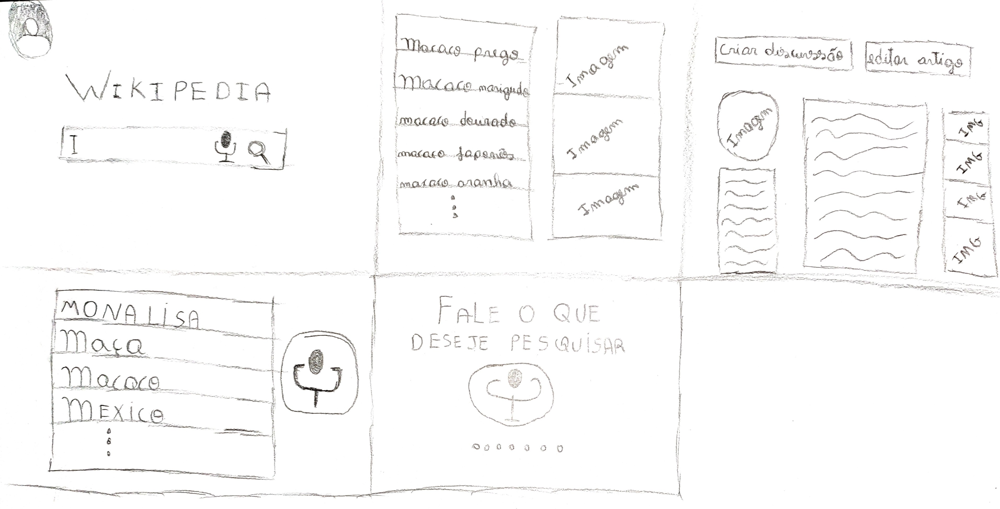
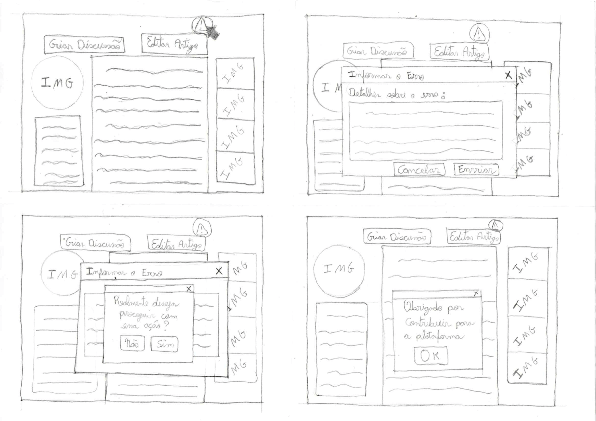
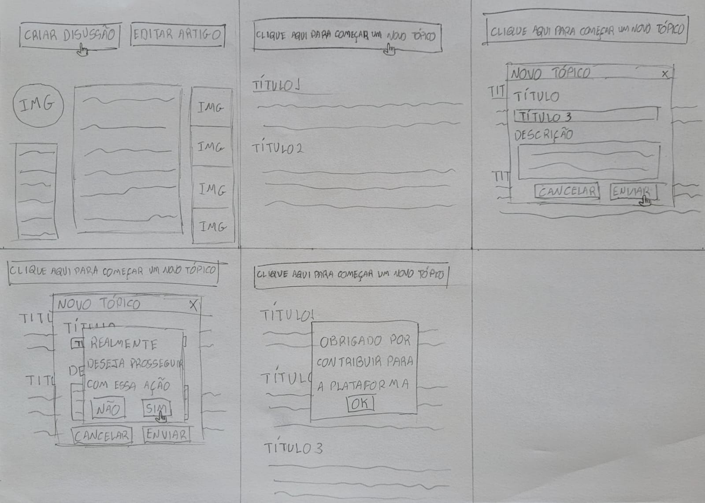
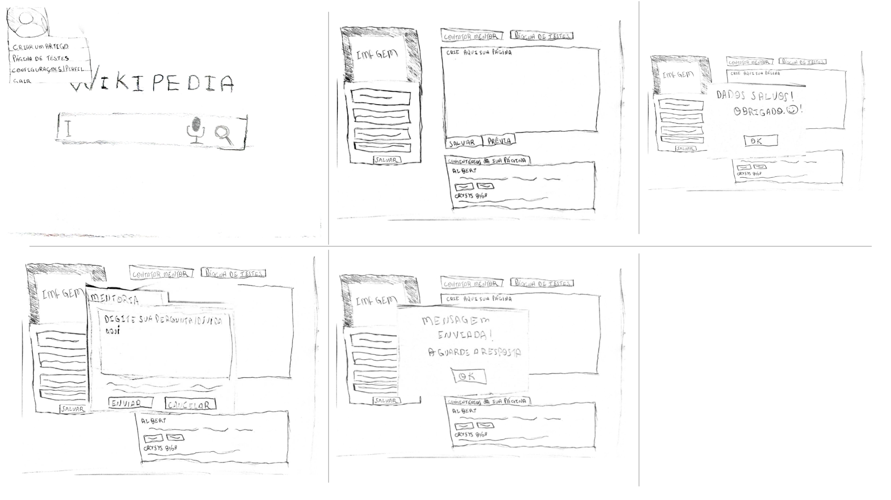
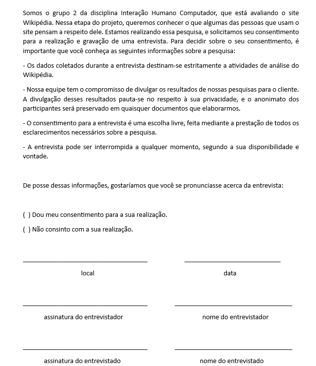

# Planejamento da Avaliação do Protótipo de Papel

## Introdução

Os protótipos desempenham um papel fundamental ao permitir que usuários e partes interessadas interajam com um produto em fase de concepção. Essa prática é extremamente útil para coletar feedback sobre pontos positivos e negativos relacionados a funcionalidades específicas ou ao produto como um todo.

A utilização de protótipos em papel proporciona um foco na funcionalidade, minimizando distrações relacionadas ao design. Dessa forma, as chances de o usuário se desviar do propósito principal são reduzidas.

Principais benefícios da utilização de protótipos incluem: análise do design, esclarecimento de requisitos e realização de testes iniciais sobre a interface da aplicação.

## Objetivos

O objetivo desta avaliação é compreender quais aspectos do aplicativo e dos fluxos alternativos estão sendo bem implementados e quais podem ser aprimorados. Buscamos obter uma lista de feedback proveniente de usuários reais.

## Metodologias

Para obter a maior quantidade possível de informações, o projeto de IHC (Interação Humano-Computador) da Wikipedia optou por utilizar entrevistas para coletar feedback sobre o design, tanto os aspectos positivos quanto os negativos. Além disso, as entrevistas permitem realizar uma série de perguntas para orientar a simulação.

Antes das entrevistas, duas ações devem ser executadas: a elaboração do protótipo em papel e a realização de um teste piloto.

O teste piloto consiste em uma execução preliminar da entrevista, geralmente realizada pelo próprio grupo de desenvolvedores ou por uma pequena amostra de participantes, com o objetivo de avaliar os aspectos do processo de avaliação e corrigir quaisquer falhas antes da implementação definitiva. Caso esse passo não seja realizado, os dados coletados podem ser invalidados.

O planejamento se baseará no uso do framework DECIDE e utilizará o método da entrevista. A combinação do framework DECIDE com o método da entrevista e o método de avaliação através de observação. A sinergia entre o framework DECIDE, a metodologia de entrevistas e a observação na avaliação cria uma abordagem poderosa e altamente eficaz. O DECIDE desempenha um papel fundamental ao estabelecer metas claras, identificar questões essenciais, selecionar métodos adequados e analisar resultados de maneira criteriosa. Por outro lado, as entrevistas oferecem uma perspectiva mais profunda dos participantes, enquanto a observação traz à tona as opiniões e os sentimentos dos usuários em relação às funcionalidades do site.

Na Tabela 1 a seguir, são apresentados os componentes do framework DECIDE juntamente com seus respectivos significados. Posteriormente, é explicado como cada componente será aplicado no projeto.

| Componente | Descrição                                                      |
| :---------: | ---------------------------------------------------------------- |
| **D** | Determinar os objetivos da avaliação de IHC.                   |
| **E** | Explorar perguntas a serem respondidas com a avaliação.        |
| **C** | Escolher (Choose) os métodos de avaliação a serem utilizados. |
| **I** | Identificar e administrar as questões práticas da avaliação. |
| **D** | Decidir como lidar com as questões éticas.                     |
| **E** | Avaliar (Evaluate), interpretar e apresentar os dados.           |

    
 Tabela 1: Framework DECIDE (Fonte:Barbosa, Silva, Silveira, et al. 2021).

Após a contextualização de cada componente do DECIDE, a seguir são apresentados os tópicos que descrevem como cada um deles será utilizado no planejamento da avaliação do protótipo de papel.

## Participantes e Entrevistadores

Os entrevistados serão convidados a partir grupos de discord, whatsapp ou então possivelmente pessoas que participaram de entrevistas em outros artefatos, assim os mesmos tem mais familiaridade com a equipe e facilidade de entender o que irá se obter da entrevista. Sobre os entrevistadores, um dos entrevistadores conduzirá a entrevista enquanto outro realizará anotações sobre os dados coletados, além de garantir que caso o entrevistado se sinta desconfortável haja a interrupção da entrevista, ou então, esse mesmo pode auxiliar o primeiro entrevistador para a realização de perguntas que o mesmo tenha deixado passar e problemas inesperados.

## Cronograma

Pensando-se nas atividades a serem realizadas para a conclusão, um cronograma é necessário para se cumprir essa atividade de avaliação, tal cronograma está contido na Tabela 1

| Passos | Descrição                                      | Data          | Local( em caso de reunião) | Realizador(es)                             | Revisor(es)                               |
| ------ | ------------------------------------------------ | ------------- | --------------------------- | ------------------------------------------ | ----------------------------------------- |
| 1      | Desenvolvimento do Prótipos de Baixa Fidelidade | 29/05 a 02/06 | Sem necessidade             | Ana,Chaydson,Gabriel,Lucas, Samuel e Pedro | Ana,Chaydson,Gabriel,Lucas, Samuel e Pedr |
| 2      | Teste Piloto                                     | 03/06         | Teams ou Google Meet        | Gabriel e Samuel                           | Lucas                                     |
| 3      | Entrevista 1                                     | 05/06         | Teams ou Google Meet        | Ana e Lucas                                | Pedro                                     |
| 4      | Entrevista 2                                     | 06/06         | Teams ou Google Meet        | Pedro e Chaydson                           | Gabriel                                   |
| 5      | Interpretação dos Dados e Possíveis Melhorias | 07/06 a 09/06 | Teams                       | Gabriel e Samuel                           | Chaydson e Lucas                          |

    
 Tabela 1: Cronograma da avaliação do protótipo de baixa-fidelidade (Fonte: Autores. 2023).

O passo 5 da tabela 1, está relacionado ao relato do resultados da Etapa 7 a ser realizada, como descrito no [cronograma planejado do projeto](../../../planejamento/cronogramaPlanejado.md) realizado anteriormente. Nas partes descritas 'Sem necessidade', no caso da Tabela 1, o local, se refere que as atividades não serão feitas em alguma plataforma de reuniões, mas sim pelos próprios membros fora de reuniões.

## Ferramentas Utilizadas

As ferramentas utilizadas para a reunião da entrevista será utlizada o Teams para usuários que possuem conta no mesmo, e o Google Meet, caso o usuário não tenha uma conta com possibilidade de acesso ao Teams. Sendo, os prótotipos, desenvolvidos com desenhos feitos papel e caneta ou lápis e borracha. Em caso do usuário, necessitar expressar uma ideia, será pedido que ele traga de antemão uma folha A e uma caneta, ou que descreva a ideia, para que um dos entrevistadores possa representar sua ideia da melhor maneira possível.

## Prótotipo de Papel

O prótotipo de papel está utilizando os fluxos identificados durante a pesquisa documental e questionário no [perfil de usuário](../../../analise-de-requisitos/perfilDeUsuario.md) e seu posterior refinamento nas Análises de Tarefas [AHT](../../../analise-de-requisitos/aht.md) e [GOMS](../../../analise-de-requisitos/goms.md) e posteriormente refinadas dessa análise. Os fluxos que serão prototipados para se realizar a avaliação são 6, baseando na atividades contidas na Análise de Tarefas de [AHT](../../../analise-de-requisitos/aht.md) e [GOMS](../../../analise-de-requisitos/goms.md), contidos na Tabela 2

| Número | Tarefa                                     | Rastro                                      |
| ------- | ------------------------------------------ | ------------------------------------------- |
| 1       | Edição de um artigo                      | [AHT](../../../analise-de-requisitos/aht.md)   |
| 2       | Criação de um artigo no Wikipédia       | [GOMS](../../../analise-de-requisitos/goms.md) |
| 3       | Realização de uma pesquisa na Wikipédia | [GOMS](../../../analise-de-requisitos/goms.md) |
| 4       | Informar um erro                           | [GOMS](../../../analise-de-requisitos/goms.md) |
| 5       | Contatar um Mentor                         | [GOMS](../../../analise-de-requisitos/goms.md) |
| 6       | Criar uma discussão sobre artigo          | [GOMS](../../../analise-de-requisitos/goms.md) |

    
 Tabela 2: Fluxos a serem prototipadas (Fonte: Autores. 2023).

### Realizar uma pesquisa

Na Figura 1, apresentamos um protótipo em papel da tarefa de pesquisar um artigo na Wikipédia, existe também dois fluxos, um onde o usuário pesquisa por voz e o outro que digita.

Com esse novo design, propomos um design mais minimalista e agrádavel ao usuário.

Como as outras tarefas se derivam de uma pesquisa a um artigo, esse prototipo será a base para as outras tarefas.

Figura 1: Protótipo de baixa fidelidade do fluxo pesquisar um artigo.(Fonte: Lucas. 2023).

### Informar um erro

Na Figura 2 a seguir, apresentamos um protótipo em papel que mostra como informar um erro em artigos da Wikipédia.

Figura 2: Protótipo de baixa fidelidade do fluxo de informar erro.(Fonte: Pedro. 2023).

### Criar discussão sobre artigo

Na Figura 3 apresentamos um protótipo de papel que indica como criar uma discussão sobre artigo na WIkipédia.

Figura 3: Protótipo de baixa fidelidade do fluxo de criar discussão de artigo.(Fonte: Ana. 2023).

### Criar um artigo

Na Figura 4, apresentamos um protótipo de papel que indica como criar um artigo na Wikipédia.

Figura 4: Protótipo de baixa fidelidade do fluxo de criar um artigo.(Fonte: Samuel. 2023).

### Editar Artigo

Na Figura 5, está representado o protótipo de papel referente a edição de um artigo na Wikipédia.

Figura 5: Protótipo de baixa fidelidade do fluxo de editar um artigo.(Fonte: Chaydson. 2023).

Na Figura 6, está representado o protótipo de papel referente a contatar um mentor na Wikipédia.

Figura 6: Protótipo de baixa fidelidade do fluxo de contatar mentor.(Fonte: Gabriel. 2023).

## Entrevista

Para a entrvista o primeiro passo é definir quem vai participar da avaliação. É de extrema importância que os participantes tenham o mesmo perfil de usuário dos usuários do site Wikipédia. Esses perfis foram definidos na [página de perfil de usuário](../../../analise-de-requisitos/perfilDeUsuario.md).

## Orçamento

O orçamento será composto pelos gastos pessoais de cada participante da entrevista relacionados à energia elétrica e à internet. Quanto aos recursos de mão de obra, será considerada apenas a disponibilidade de tempo para a realização da entrevista.

## Teste piloto

No Video 1, encontra-se a gravação do teste piloto realizado pelos membros Gabriel e Samuel. A tabela 3 descreve os detalhes do teste piloto. No qual, após realizado não foi identificado nada que possa alterar os resultados

| Local | Participantes    | Data e hora          |
| ----- | ---------------- | -------------------- |
| Teams | Gabriel e Samuel | 12/06/2023 às 14:45 |

    
 Tabela 3: Realização do teste piloto (Fonte: Gabriel e Samuel. 2023).

<iframe width="560" height="315" src="https://www.youtube.com/embed/Crbco_AppLA" title="YouTube video player" frameborder="0" allow="accelerometer; autoplay; clipboard-write; encrypted-media; gyroscope; picture-in-picture; web-share" allowfullscreen></iframe>

    
 Video 1: Realização do teste piloto (Fonte: Gabriel e Samuel. 2023).

### Termo de consentimento

No termo de consentimento buscamos esclarecer os objetivos da entrevista, solicitar explicitamente o consentimento do participante e informar dados sobre a pesquisa. O termo de consentimento, apresentado na figura 1, será aplicado no início da entrevista, antes de qualquer atividade, para que o participante tenha ciência do que será feito e possa decidir se quer ou não participar.

Figura 1: Termo de Consentimento, versão 1.(Fonte: Autores. 2023).

### Roteiro de perguntas

A tabela 4 apresenta o roteiro de perguntas que comporá a entrevista. O roteiro pode ser alterado conforme o andamento da entrevista ou segundo a necessidade do entrevistador.

| Pergunta                                                                                                          | Possível resposta                                       | Instrução                                                                        |
| ----------------------------------------------------------------------------------------------------------------- | -------------------------------------------------------- | ---------------------------------------------------------------------------------- |
| Você já fez `nome do fluxo/atividade`                                                                         | Sim/Não                                                 | -                                                                                  |
| Qual a frequência que você executa `nome do fluxo/atividade`?                                                 | Quantidade em relação a determinado intervalo de tempo | Pergunte caso a primeira resposta seja sim                                         |
| Realize `nome do fluxo/atividade`. Descreva o pensamento atrás de cada ação feita.                           | Discursiva                                               | Em caso de usuário com dificuldade, entrevistador deverá ajudá-lo via perguntas |
| Após simulação da `nome do fluxo/atividade`, você identifica que a sequência das atividades seja coerente? | Sim/Não/Inconclusivo                                    | -                                                                                  |
| Explique o motivo da sua resposta                                                                                 | Discursiva                                               | -                                                                                  |
| Você imagina outra forma de solução para `nome do fluxo/atividade`                                           | Sim/Não                                                 | -                                                                                  |
| Poderia descrever essa solução                                                                                  | Discursiva                                               | Pergunte caso a resposta anterior seja sim                                         |

    
 Tabela 4: Roteiro de perguntas (Fonte: Autores. 2023).

## Conclusão

Essa página apresenta o planejamento da avaliação do protótipo de papel. O avaliador pode seguir o que está descrito e fazer alterações caso haja necessário.

## Bibliografia

BARBOSA, Simone; DINIZ, Bruno. Interação Humano-Computador. Editora Elsevier, Rio de Janeiro, 2010.

## Histórico de Versão

| Versão | Data       | Descrição                       | Autor(es)            | Revisor(es) |
| ------- | ---------- | --------------------------------- | -------------------- | ----------- |
| 1.0     | 29/05/2023 | Criação do documento            | Lucas, Ana e Gabriel | Pedro       |
| 1.1     | 19/06/2023 | Ajustes e Correções do artefato | Gabriel, Lucas e Ana | Chaydson    |
