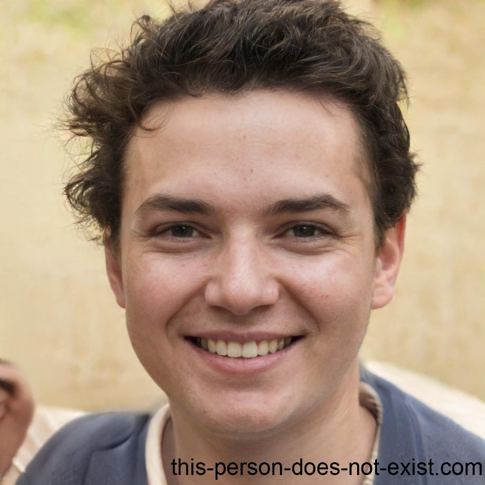

## Introdução

Bem-vindo à página de personas do projeto! Aqui você encontrará uma lista de personas e antipersona que serão utilizados para projeto. Essas personas são pessoas ficticias, para definir nosso público-alvo, o qual foram selecionadas e baseadas no perfil de usuário, assim tendo base para definir as personas.

### Definição

Foi escolhido 3 personas, encontradas na tabela 1, 2 e 3, e também foi escolhida 1 antipersona, encontrada na tabela 4. As personas são baseadas em usuários reais, e a antipersona é baseada em um usuário que não é o público-alvo do projeto. Foram escolhidos esses números pois no livro da Simone Diniz Junqueira Barbosa, "Interação Humano-Computador", é recomendado que sejam escolhidas de 3 a 5 personas, e 1 antipersona.

## Personas

### Luís Silva

|                                                                                                                                                                                                                                                                                                                                                                                                   |
| :--------------------------------------------------------------------------------------------------------------------------------------------------------------------------------------------------------------------------------------------------------------------------------------------------------------------------------------------------------------------------------------------------------------------------------------------: |
|                                                                                                                                                                                                              **Nome:** Luís Silva                                                                                                                                                                                                              |
|                                                                                                                                                                                                             **Gênero:** Masculino                                                                                                                                                                                                              |
|                                                                                                                                                                                                                 **Idade:** 27                                                                                                                                                                                                                  |
|                                                                                                                                                                                                  **Escolaridade:** Ensino superior incompleto                                                                                                                                                                                                  |
|                                                                                                                                                                                                        **Profissão:** Designer gráfico                                                                                                                                                                                                         |
|                                                                                                                                                                                                   **Relacionamentos:** Solteiro, sem filhos                                                                                                                                                                                                    |
|                                                                                                                                                                                                          **Status:** Persona primária                                                                                                                                                                                                          |
|                                                                                                    **Objetivos:** Luís é um curioso que adora explorar tópicos aleatórios e aprender coisas novas. Ele utiliza o Wikipedia como uma fonte acessível para satisfazer sua curiosidade e descobrir novas informações sobre assuntos diversos.                                                                                                     |
|                                                                                                                          **Habilidades:** Luís possui habilidades avançadas de pesquisa na internet e navegação em sites. Ele também tem uma boa compreensão da língua portuguesa e habilidades de leitura e escrita.                                                                                                                          |
| **Tarefas:** Luís utiliza o Wikipedia diariamente para explorar tópicos diversos e aprender coisas novas. Ele geralmente começa suas pesquisas com um tópico de seu interesse e acaba navegando por vários outros artigos relacionados. Luís também dedica tempo para revisar as informações encontradas e absorver novos conhecimentos. Ele utiliza o que aprendeu em suas conversas do dia-a-dia e para melhorar seu desempenho no trabalho. |
|                                                                                        **Requisitos:** Para satisfazer sua curiosidade, Luís precisa de acesso a uma ampla variedade de informações precisas e confiáveis, que possam ser facilmente compreendidas por ele. Ele também precisa de uma plataforma de pesquisa fácil de usar e acessível.                                                                                        |
|                                                                  **Expectativas:** Luís espera que o Wikipedia seja uma fonte confiável e acessível de informações para satisfazer sua curiosidade e ajudá-lo a descobrir novas informações e ideias. Ele espera que a plataforma ajude a expandir seu conhecimento e contribua para seu crescimento pessoal e profissional.                                                                   |
|                                                                                                                                                                                        **Endereço:** Luís mora com seu cachorro em Caxias do Sul - RS.                                                                                                                                                                                         |
|                                                                                                                                                                                              **Locomoção:** Luís se locomove em sua motocicleta.                                                                                                                                                                                               |

 Tabela 1: Persona Primária 1, versão 1. (Fonte: Autores. 2023).

### Maria Luíza Oliveira

|                                                                                                                                                                                                                              |
| :-------------------------------------------------------------------------------------------------------------------------------------------------------------------------------------------------------------------------------------------------------------------------------------: |
|                                                                                                                             **Nome:** Maria Luíza Oliveira                                                                                                                              |
|                                                                                                                                  **Gênero:** Feminino                                                                                                                                   |
|                                                                                                                                      **Idade:** 16                                                                                                                                      |
|                                                                                                                             **Escolaridade:** Ensino médio                                                                                                                              |
|                                                                                                                                **Profissão:** Estudante                                                                                                                                 |
|                                                                                                                        **Relacionamentos:** Solteira, sem filhos                                                                                                                        |
|                                                                                                                              **Status:** Persona primária                                                                                                                               |
|                    **Objetivos:** Maria Luíza é uma estudante do ensino médio e utiliza o Wikipedia para realizar pesquisas e trabalhos escolares. Seu objetivo é encontrar informações precisas e confiáveis para utilizar em seus estudos e ter sucesso acadêmico.                    |
|                                    **Habilidades:** Maria Luíza possui habilidades básicas de pesquisa na internet e navegação em sites. Ela também tem uma boa compreensão da língua portuguesa, o que a ajuda a entender os artigos do Wikipedia.                                     |
|                      **Tarefas:** Maria Luíza utiliza o Wikipedia diariamente para auxiliar em seus estudos e trabalhos escolares. Ela geralmente inicia suas pesquisas logo após as aulas, buscando informações precisas e confiáveis para completar suas tarefas                      |
|                    **Requisitos:** Para ter sucesso em seus estudos, Maria Luíza precisa de acesso a informações precisas e confiáveis que possam ser facilmente compreendidas por ela. Ela também precisa de uma plataforma de pesquisa fácil de usar e acessível.                     |
| **Expectativas:** Maria Luíza espera que o Wikipedia seja uma fonte confiável e acessível de informações para suas pesquisas escolares e para aprender sobre diferentes assuntos. Ela espera que a plataforma ajude a expandir seu conhecimento e contribua para seu sucesso acadêmico. |
|                                                                                                            **Endereço:** Maria mora com seus pais em Planalto Itaperuna - RJ                                                                                                            |
|                                                                                              **Locomoção:** Maria Luíza utiliza seu passe escolar e assim, utiliza os onibús da prefeitura                                                                                              |

 Tabela 2: Persona Primária 2, versão 1. (Fonte: Autores. 2023).

### Rodrigo Lucas da Cunha

|                                                                                                                                                                                                                      |
| :----------------------------------------------------------------------------------------------------------------------------------------------------------------------------------------------------------------------------------------------------------------------------: |
|                                                                                                                        **Nome:** Rodrigo Lucas da Cunha                                                                                                                        |
|                                                                                                                             **Gênero:** Masculino                                                                                                                              |
|                                                                                                                                 **Idade:** 50                                                                                                                                  |
|                                                                                                                   **Escolaridade:** Ensino superior completo                                                                                                                   |
|                                                                                                                     **Profissão:** Pesquisador cientifíco                                                                                                                      |
|                                                                                                                    **Relacionamentos:** Casado, sem filhos                                                                                                                     |
|                                                                                                                          **Status:** Persona primária                                                                                                                          |
|         **Objetivos:** Rodrigo é um pesquisador com interesse em divulgar o conhecimento por meio do Wikipedia. Ele deseja escrever artigos completos e precisos sobre temas específicos da sua área de pesquisa e compartilhar esse conhecimento com outras pessoas.          |
|                            **Habilidades:** Por ser um pesquisador experiente e possui conhecimento aprofundado em sua área de estudo, além de possuir habilidades de escrita e comunicação para transmitir informações de forma clara e objetiva.                             |
|                             **Tarefas:** Rodrigo dedica grande parte de seu tempo para realizar pesquisas, levantar informações e analisar dados. Ele também dedica tempo para escrever e revisar seus artigos antes de publicá-los no Wikipedia.                              |
|    **Requisitos:** Para produzir conteúdo de qualidade, Paulo precisa de acesso a fontes confiáveis e atualizadas de informações relevantes para sua área de pesquisa. Ele também precisa de uma plataforma de publicação confiável e acessível para publicar seus artigos.    |
| **Expectativas:** Paulo espera que o Wikipedia seja uma plataforma confiável e acessível que permita a ele compartilhar seus conhecimentos com outras pessoas. Ele espera que seus artigos sejam bem recebidos e contribuam para o conhecimento geral em sua área de pesquisa. |
|                                                                                                           **Endereço:** Rodrigo mora com sua esposa em Itabuna - BA                                                                                                            |
|                                                                                                               **Locomoção:** Rodrigo anda em seu carro próprio.                                                                                                                |

 Tabela 3: Persona Primária 3, versão 1. (Fonte: Autores. 2023).

### Nelson Ricardo Jesus

|                                                                                                                                                                                                                                                                                                                                                                                                                                           |
| :--------------------------------------------------------------------------------------------------------------------------------------------------------------------------------------------------------------------------------------------------------------------------------------------------------------------------------------------------------------------------------------------------------------------------------------------------------------------------------------------------------: |
|                                                                                                                                                                                                                                       **Nome:** Nelson Ricardo Jesus                                                                                                                                                                                                                                       |
|                                                                                                                                                                                                                                           **Gênero:** Masculino                                                                                                                                                                                                                                            |
|                                                                                                                                                                                                                                               **Idade:** 45                                                                                                                                                                                                                                                |
|                                                                                                                                                                                                                                     **Escolaridade:** Sem escolaridade                                                                                                                                                                                                                                     |
|                                                                                                                                                                                                                                          **Profissão:** Pedreiro                                                                                                                                                                                                                                           |
|                                                                                                                                                                                                                                    **Relacionamentos:** Casado, 1 filha                                                                                                                                                                                                                                    |
|                                                                                                                                                                                                                                          **Status:** Antipersona                                                                                                                                                                                                                                           |
|                                                                                                                                                                                   **Objetivos:** Por ser um analfabeto, Nelson não consegue escrever e nem ler, por este motivo, o site da wikipédia não lhe interessa.                                                                                                                                                                                    |
|                                                                                               **Habilidades:**  Nelson enfrenta desafios ao usar tecnologia, especialmente quando se trata de aplicativos de pesquisa. Como ele não sabe ler e escrever, é difícil para ele navegar pelos aplicativos e encontrar informações. Quando ele precisa pesquisar sobre algo, ele pede ajuda sua esposa ou filha.                                                                                                |
| **Tarefas:** No dia-a-dia de Nelson, ele é um homem trabalhador que atua como pedreiro. Ele pode começar o dia cedo, talvez por volta das 6:00 ou 7:00, para chegar ao canteiro de obras a tempo. Ele trabalha duro durante o dia, construindo e reparando estruturas. Depois do trabalho, ele pode voltar para casa e descansar, talvez assistindo TV ou passando tempo com a família. Como Nelson é analfabeto, ele pode enfrentar desafios em algumas atividades diárias que exigem leitura e escrita.. |
|                                                                                                                                                                                                   **Expectativas:** Não possui expectativas com a wikipédia, dado sua incapacidade de leitura e escrita.                                                                                                                                                                                                   |
|                                                                                                                                                                                                                **Endereço:** Nelson mora com sua esposa em Recanto das Emas - Brasília - DF                                                                                                                                                                                                                |
|                                                                                                                                                                                                                            **Locomoção:** Nelson se locomove em sua bicicleta.                                                                                                                                                                                                                             |

 Tabela 4: Antipersona, versão 1. (Fonte: Autores. 2023).

## Bibliografia

‌BARBOSA, Simone Diniz Junqueira; DA SILVA, Bruno Santana. Interação Humano - Computador. Rio de janeiro: Elsevier, 2010. Acesso em 30 de abril de 2023.

UNIVESP. Engenharia de Computação - 16º Bimestre - Interfaces Humano-Computador – EES-301. Youtube, 15 out. 2021. Disponível em: https://youtu.be/duxDSDzxemk. Acesso em: 30 abr. 2023.

## Histórico de Versão

| Versão | Data       | Descrição                     | Autor(es)             | Revisor(es)   |
| ------ | ---------- | ----------------------------- | --------------------- | ------------- |
| 1.0    | 30/04/2023 | Criação da página de personas | Pedro, Lucas e Samuel | Gabriel e Ana |
| 1.1    | 04/05/2023 | Variando as personas          | Lucas e Pedro         | Gabriel e Ana |
