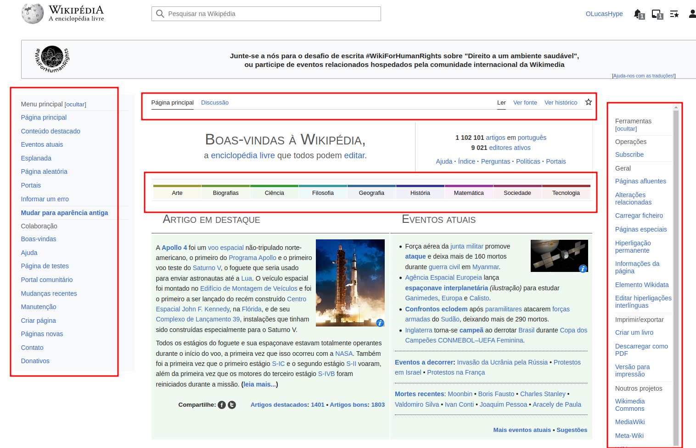
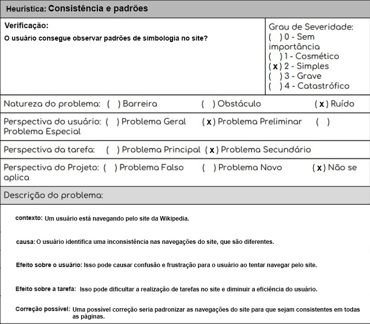
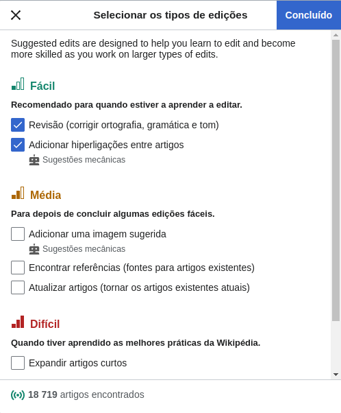
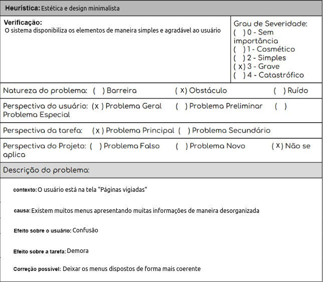
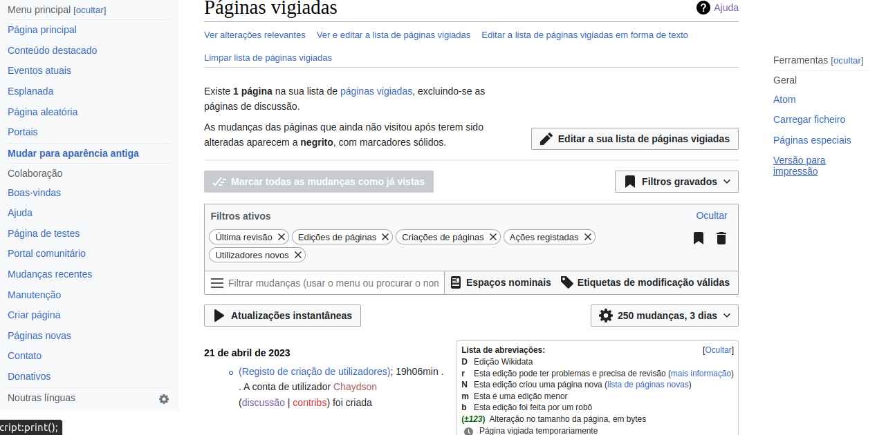
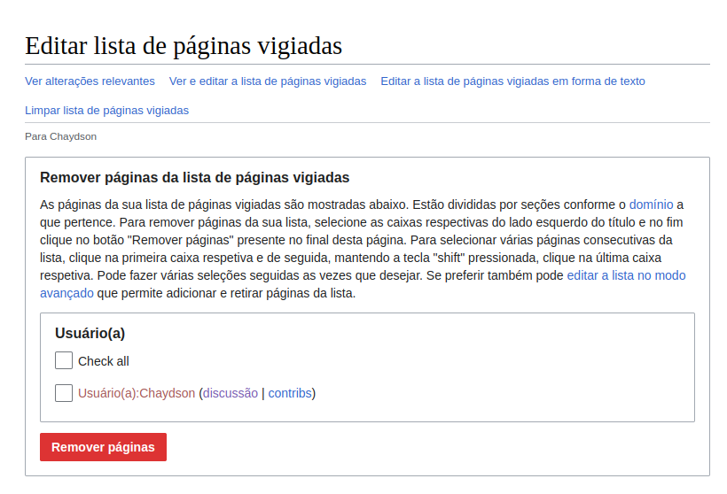
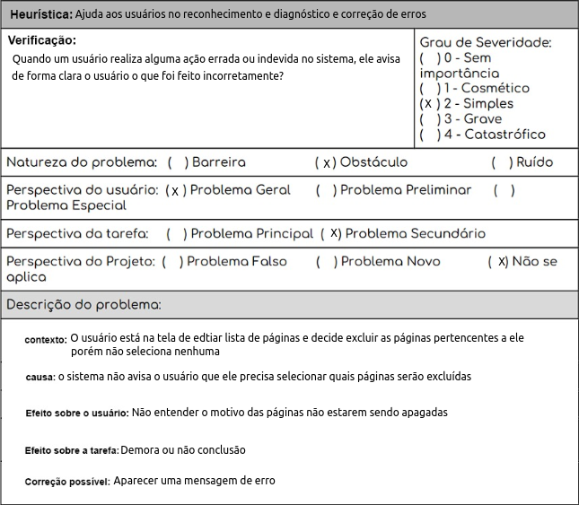
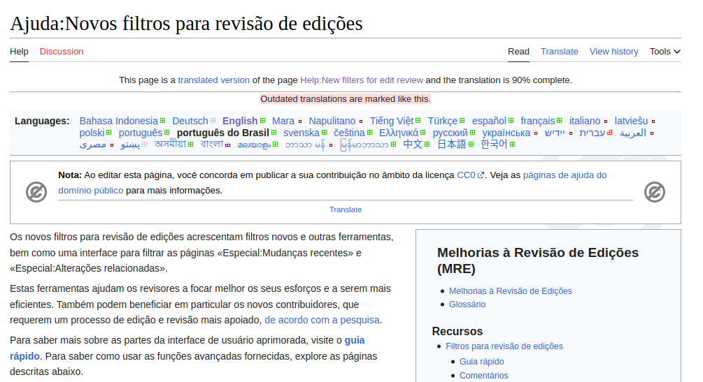

# Site escolhido para o projeto da disciplina

## Introdução

DECIDE é um framework para apoio à tomada de decisão em design de interfaces de usuário. Ele fornece uma estrutura sistemática para avaliar a usabilidade de um sistema interativo, considerando aspectos como eficácia, eficiência e satisfação do usuário. Uma das técnicas de avaliação recomendadas pelo DECIDE é a avaliação heurística, que envolve a análise sistemática da interface por especialistas em usabilidade, identificando problemas de usabilidade com base em um conjunto de princípios heurísticos.

## Framework DECIDE

Esta avaliação é baseada no Framework DECIDE que é dividido em 6 etapas. O site escolhido para ser avaliado é a Wikipedia (https://pt.wikipedia.org/). Se trata de uma enciclopédia online colaborativa e gratuita com milhões de artigos em diversos idiomas e tópicos, mantida pela Fundação Wikimedia. Os artigos são escritos em um estilo claro e conciso, com links para outras fontes e artigos relacionados. A Wikipedia é organizada em seções e permite que os usuários criem e editem conteúdo de forma colaborativa. É um recurso útil para qualquer pessoa que queira aprender algo novo ou expandir seus conhecimentos em um determinado assunto.

A primeira etapa é determinar os objetivos gerais da avaliação. Os objetivos incluem:

1. Identificar possíveis problemas de usabilidade e acessibilidade do site, como dificuldades de navegação ou problemas de legibilidade.
2. Identificar oportunidades de melhorias no design e na apresentação do conteúdo para torná-lo mais atraente e apresentável para os usuários.
3. Avaliar a experiência geral do usuário, incluindo a facilidade de uso do site, a qualidade da pesquisa, a relevância dos resultados e a capacidade de encontrar informações relevantes de forma rápida e eficiente.
4. Identificar possíveis problemas de acessibilidade, como a falta de compatibilidade com diferentes dispositivos e navegadores ou a falta de recursos para usuários com deficiência visual ou auditiva.

A segunda etapa envolve explorar perguntas a serem respondidas, ou seja, questões que a avaliação pretende responder como, por exemplo:

1. Quais são os possíveis problemas de usabilidade e acessibilidade do site da Wikipedia que podem afetar a navegação ou a legibilidade para os usuários? 
2. De que forma o design e a apresentação do conteúdo da Wikipedia poderiam ser melhorados para torná-los mais atraentes e apresentáveis aos usuários?
3. O site é fácil de usar? 
4. A pesquisa no site oferece resultados precisos? 
5. O site é responsivo? 
6. O site é acessível para diferentes usuários?

A terceira etapa inclui escolher o método de avaliação que será utilizado. Como o objetivo é basicamente avaliar a usabilidade do site, o método escolhido foi a avaliação heurística que é uma abordagem que envolve a análise da interface com base em princípios heurísticos estabelecidos, como a consistência e feedback do sistema. Essa abordagem é mais adequada para avaliar a usabilidade geral da interface, identificar problemas de design e fornecer recomendações para melhorias.
A quarta etapa se refere a questões práticas abordadas pela avaliação. No caso da avaliação de usabilidade do site Wikipédia algumas questões práticas seriam:

1. Facilidade de navegação: O site oferece uma navegação clara e intuitiva para os usuários, facilitando o acesso aos diferentes tópicos e seções?
2. Legibilidade: Os textos são claros e de fácil leitura, com um tamanho de fonte adequado e boa contraste para facilitar a leitura para usuários com diferentes habilidades visuais?
3. Consistência: O site mantém uma consistência visual em relação à sua marca, cores, fontes e estilos de página em todas as seções?
4. Acessibilidade: O site oferece recursos para usuários com deficiências visuais ou auditivas, como uma opção de texto alternativo para imagens?
5. Responsividade: O site é responsivo e se adapta bem a diferentes dispositivos, incluindo desktops, tablets e smartphones?
6. Facilidade de pesquisa: O recurso de pesquisa é fácil de encontrar e usar, e os resultados apresentados são relevantes e precisos?
7. Personalização: O site oferece recursos de personalização, como a possibilidade de alterar o tamanho do texto ou escolher o idioma do conteúdo?

A quinta etapa é para decidir como lidar com questões éticas. Avaliações envolvem usuários, participantes que serão observados e terão suas ações avaliadas. Por isso, na etapa decidir como lidar com questões éticas, faz-se necessário considerar questões relacionadas à privacidade dos participantes. É recomendada a total privacidade dos participantes, principalmente na divulgação dos resultados, de modo que os dados coletados não possam identificar o participante, evitando constrangimento e problemas relacionados aos registros coletados. Por tanto é necessário obter consentimento dos usuários para participar da avaliação e garantir sigilo dos dados coletados.

A última etapa se refere a avaliar, interpretar e apresentar os dados obtidos. O objetivo é coletar os dados, analisar e apresenta-los da melhor forma, ficando atento as perguntas feitas na segunda etapa e no método escolhido na terceira etapa. 

Em conclusão, a avaliação da Wikipedia com DECIDE identificou objetivos, perguntas e um método adequado. Foram definidos objetivos para identificar problemas de usabilidade e acessibilidade, avaliar a experiência do usuário e escolher a avaliação heurística. Considerações éticas foram apresentadas e as recomendações para melhorar a usabilidade e acessibilidade serão fornecidas com base na avaliação dos dados coletados.

## Avaliação Heurística

### 1. Status do sistema

Não foram identificados problemas em relação a esse aspecto, uma vez que o site fornece informações relevantes ao usuário em tempo hábil, permitindo que ele compreenda o que está acontecendo.

### 2. Compatibilidade do sistema com o mundo real

A Wikipedia não atende corretamente a esta heurística em alguns casos, como na nomenclatura de alguns termos específicos, que podem não ser facilmente compreendidos por usuários iniciantes ou que não estejam familiarizados com os termos técnicos, como pode ser observado na Figura 1. Além disso, algumas interfaces podem não ser intuitivas o suficiente para o usuário, o que pode levar a confusão e erros de navegação.

    
 Figura 1: Compatibilidade do sistema com o mundo real, versão 1. (Fonte: Autores. 2023).

### 3. Controle do usuário e liberdade

Não foram identificados problemas em relação a esse aspecto, uma vez que o site fornece funções disponíveis que possibilitam saídas de funções indesejadas. O menu lateral está presente a todo momento garantindo uma boa navegabilidade. 

### 4. Consistência e padrões

Foram encontrados problemas nessa heurística, pois o site não oferece um padrão de navegação e botoẽs ao longo de todas as páginas. Além disso, as páginas não possui um padrão de cores, o que pode confundir o usuário, como exemplificao na Figura 2.

    
 Figura 2: Tela fora do padrão, versão 1. (Fonte: Autores. 2023).

Abaixo na Figura 3 está a avaliação dessa heurística:

    
 Figura 3: Consistência e padrões, versão 1. (Fonte: Autores. 2023).

### 5. Prevenção de erros

Não foram encontrados problemas com relação a esse aspecto, pois o design do sítio está
adaptado para prevenir que usuários cometam erros ao colocar alguma entrada incorreta ao
utilizá-lo.

### 6. Reconhecimento ao invés de lembrança

Esse aspecto não apresentou problemas, pois o sistema mostra as informações necessárias para o seu funcionamento adequado no contexto em que o usuário está. Assim, o usuário não precisa memorizar nenhuma informação que estava em uma página anterior do mesmo site.

### 7. Flexibilidade e eficiência de uso

A Wikipedia atende à heurística Flexibilidade e eficiência de uso de Nielsen na tela "Selecionar tipo de edição" ao permitir que os usuários personalizem sua experiência, conforme exemplifica a Figura 4. Na tela, os usuários podem escolher entre a dificuldade da edição a ser feita, portanto abrangendo mais pessoas.

    
 Figura 4: Flexibilidade e eficiência de uso, versão 1. (Fonte: Autores. 2023).

### 8. Estética e design minimalista

A página "Páginas vigiadas" da Wikipedia não atende adequadamente a essa heurística, uma vez que a página é confusa visualmente e pode ser considerada poluída em termos de design, como mostrado na Figura 5. A interface contém muitos elementos diferentes, como caixas de seleção, botões e diversos menus, o que pode sobrecarregar a página e dificultar a navegação. No geral, a página "Páginas vigiadas" pode ser melhorada visualmente para torná-la mais esteticamente agradável e mais fácil de usar como é possível observar na imagem abaixo: 

    
 Figura 5: Exemplo de tela fora que não atende a heurística, versão 1. (Fonte: Autores. 2023).

Segue a avaliação heurística dessa tela na Figura 6:

    
 Figura 6: Estética e design minimalista, versão 1. (Fonte: Autores. 2023).

### 9. Ajuda aos usuários no reconhecimento e diagnóstico e correção de erros

A tela de edição de páginas vigiadas na Wikipedia apresenta falhas na heurística de Ajuda aos usuários no reconhecimento e diagnóstico e correção de erros, conforme mostra a Figura 7. Isso porque, ao tentar editar uma página vigiada, o usuário não recebe uma mensagem de erro ao tentar fazer uma ação indevida. Isso pode dificultar a identificação do erro e a correção por parte do usuário, impactando negativamente na usabilidade da plataforma.

    
 Figura 7: Falha na ajuda aos usuários no reconhecimento , versão 1. (Fonte: Autores. 2023).

Segue a avaliação heurística dessa tela na Figura 8:

    
 Figura 8: Ajuda aos usuários no reconhecimento e diagnóstico e correção de erros, versão 1. (Fonte: Autores. 2023).

### 10. Ajuda e documentação

A Wikipedia atende corretamente à heurística Ajuda e Documentação de Nielsen ao fornecer uma ampla variedade de recursos de ajuda e documentação para seus usuários, exemplificado pela Figura 9. O site possui uma seção de ajuda abrangente que aborda uma variedade de tópicos, desde como editar uma página até como criar uma nova página. Além disso, a Wikipedia oferece um guia de edição que fornece orientações detalhadas sobre como criar e editar conteúdo. Há também fóruns de discussão e uma comunidade ativa de editores que estão disponíveis para responder a perguntas e fornecer suporte aos usuários. Todos esses recursos ajudam a garantir que os usuários da Wikipedia possam encontrar ajuda e suporte quando precisam.

    
 Figura 9: Ajuda e documentação, versão 1. (Fonte: Autores. 2023).

| Versão | Data       | Descrição                            | Autor(es) | Revisor(es)    |
| ------- | ---------- | -------------------------------------- | --------- | -------------- |
| 1.0     | 07/04/2023 | Criação do Documento             | Lucas  | Gabriel            |
| 1.1     | 07/04/2023 | Heuristica 4, 5 e 6             | Lucas  | Gabriel            |
| 1.3     | 22/04/2023 | Criação do texto do decide e as heurísticas que faltavam            | Lucas, Pedro, Ana e Chaydson  | Gabriel            |
