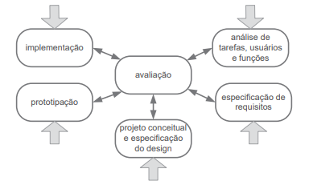

# Processo de Design

## Introdução

O processo de design é uma parte importante do desenvolvimento de um projeto de IHC(Interação Humano Computador), consistindo na execução organizada e iterativa de uma atividade de design em busca de conhecimento do problema e construção de solução(intervenção) para esse problema, sendo essas atividades de design dividas em:

-**Análise de Contexto** : Consiste no estudo e interpretação da situação atual

-**Síntese de Intervenção**: Planejar e executar intervenções(soluções) na situação presente

-**Avaliação da Nova situação** : Comparar os efeito que a nova intervenção trouxe comparando-a com a intervenção anterior.

Essa atividades irão ser repetidas em iterações que refinarão o projeto, até que a proposta de intervenção esteja solucionando satisfatoriamente o problema para projeto de IHC, com essa atividade sistemática visando trazer a eficiência no desenvolvimento e conhecimento do produto e problema do mesmo.

## Modelos de Ciclo de Vida

### Ciclo de Vida Simples

O Ciclo de Vida Simples na construção de uma sequência genérica de atividades de design, na qual inicia-se o projeto identificando as necessidades e definindo os requisitos do produto, para numa etapa seguinte o design analisar e cria um esboço de como funcionará o sistema, caso seja satisfatório, o mesmo avança para a fase de gerar um protótipo interativo do esboço ou voltar a etapa anterior para adicionar a intervenção caracteristicas que o designer não havia pensado. Para a fase de construção de uma versão interativa, caso a intervenção esteja completada com sucesso ela vai para a etapa de avaliação, caso não ela retorna a etapa anterior que a de (re-)design. Após a avaliação, se a solução desenvolvida atende o necessidades e  o requisitos identificados anteriormente o processo é finalizado e é dado um passo posterior ao processo de design para se desenvolver o sistema interativo. Caso não atenda, ele vai para  etapa de identificar necessidades e requisitos novamente ou a para a parte de (re-)design. Por ser muito simples, esse processo não é muito amigável com pessoas que estão aprendendo a realizar processos de design, por pular partes essenciais do desenvolvimento de design de IHC. Abaixo está uma figura do modelo simples:

<divstyle="text-align: center">

    `
` Figura 1: Modelo simples do processo de design`
`

### Ciclo de Vida em Estrela

O Ciclo de Vida em Estrela, cabe ao designer em qual parte, como demonstrada por suas setas na Figura 2, iniciar não importantando muito a ordem em que ocorrer, pois sempre irão passar pela etapa de avaliação que detectar problemas desde de a usabilidade até o sistema final. Essa etapa de avaliar o que foi desenvolvido reduz o custo que se poder ter mais para frente com retrabalho. Abaixo na está a Figura 2 demonstrando o fluxo do ciclo de vida em estrela:

<divstyle="text-align: center">

    `
` Figura 2 : Modelo de Ciclo de Vida em Estrela`
`

### Engenharia de Usabilidade de Mayhew

A engenharia de Usabilidade de Mayhew tem definido em ciclo de vida três etapas/fases que definem bem a características desse mesmo sendo elas a análise de requisitos , a fase de design, avaliação e desenvolvimento e por último a fase de instalação, como se pode ver na Figura 3, era um modelo de ciclo de vida bem detalhado do que era para se realizar

#### **Análise de Requisitos**

A Etapa/Fase de análise de requisitos consiste em definir certas atividades para se definir certas limitações, ações e condições em que o sistema funcionará tudo isso, sendo definido através de metas de usabilidades que serão definidas a partir das atividades de perfil de usuário, análise de tarefas(tarefas a serem realizadas), características da plataforma e principios gerais de projeto. As metas de usabilidade auxiliar na criação do guia de estilo define a limites e padrões a serem utilizados no desenvolvimento do projeto. Tal análise pode ocorrer em cima de alguma plataforma já desenvolvida. Após o desenvolimento dessa fase como vista na Figura 3, ocorre a próxima fase a de design, avaliação e desenvolvimento.

#### **Design, avaliação e desenvolvimento**

Essa fase consiste em três níves os quais definirão o andamento do projeto, no primeiro nível o designer irá validar por meio de documentação e criação de protótipos de baixa fidelidade e avaliação desses meios para a eliminação de falhas criticas ao sistema, enquanto essas falhas persistirem o mesmo não sairá desse nível, no nivel 2, é realizado a criação de padrões para design de telas e criar prótotipos de média fidelidade que sigam esse padrão, prosseguindo para o último nível somente quando as metas de usabilidade que foram definidas ou redefinidas anteriormente foram atendidas. Na última fase, é desenvolvido um prótotipo de alta fidelidade simulando como seria o resultado final, a avaliação desse nível consiste na confirmação se a metas de usabilidade e guia de estilo foram atendidos, caso não, o mesmo volta para a fase de análise. Todos esses passos devem ser avaliados com partipação de possíveis usuários do sistema, caso tudo tenha sido atendido, se prossegue para a última fase, a instalação.

#### **Instalação**

Na última fase, a de instalação, é realizada uma coleta de dados com base na opinião do usuário com base no uso do sistema, utilizando-se dessas informações para realizar melhorias quanto ao sistema ou planejar o desenvolvimento de novos sistemas que não foram catálogados anteriomente, por esta em uma fase muito cedo do projeto.

<divstyle="text-align: center">

Figura 3: Modelo de Ciclo de Vida com uso engenharia da usabilidade(adaptado de Mayhew,1999)

### Engenharia de Usabilidade de Nielsen

A engenharia de Usabilidade de Nielsen consiste no uso de conjunto de atividades para definir uma especie de passo a passo para o ciclo de vida de um produto/design, tais atividades e sub-atividades continham instruções do que se realizar para um bom ciclo de vida e solucionar problemas, sendo as atividades:

| Número | Atividade                                           |

| :-----: | --------------------------------------------------- |

|    1    | Conheça seu usuário                               |

|    2    | Realize uma análise competitiva                    |

|    3    | Defina as metas de usabilidade                      |

|    4    | Faça designs paralelos                             |

|    5    | Adote o design participativo                        |

|    6    | Faça o design coordenado da interface como um todo |

|    7    | Aplique diretrizes e análise heurística           |

|    8    | Faça protótipos                                   |

|    9    | Realize testes empíricos                           |

|   10   | Pratique design iterativo                           |

<divstyle="text-align: center">

    `
` Tabela 1: Conjunto de Atividades de Nielsen.`
`

## Ciclo de Vida Escolhido

Baseando na escolha de grupo e nas atividades desenvolvidas até o momento pelo grupo, o ciclo de vida escolhido foi o de Mayhew, tal ciclo foi escolhido devido a suas caracteríticas  e processos , considerados pelo grupo essenciais para o desenvolvimento do projeto na matéria, e se adequar mais ao proposto pela disciplina e cronograma desenvolvido. Entretanto apesar de escolher esse ciclo de vida, o grupo pode utilizar e adaptar  o uso de outros modelosem parte para se obter resultados desejados, para realizar o desenvolvimento de partes que necessitem de adaptação, caso seja necessário.

## Bibliografia

Barbosa, S. D. J.; Silva, B. S. da; Silveira, M. S.; Gasparini, I.; Darin, T.; Barbosa, G. D. J. (2021)

Interação Humano-Computador e Experiência do usuário. Autopublicação. ISBN: 978-65-00-19677-1. Acesso em 23 de Abril de 2023.

## Histórico de Versão

| Versão | Data       | Descrição                          | Autor(es) | Revisor(es) |

| ------- | ---------- | ------------------------------------ | --------- | ----------- |

| 1.0     | 23/04/2023 | Documentação do Processo de Design | Gabriel   | Ana Luiza   |
