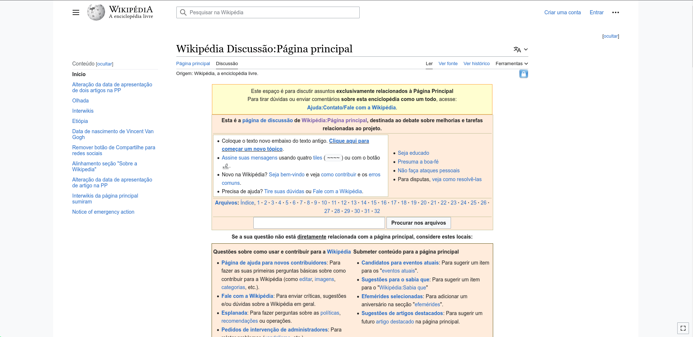

## Introdução

Bem-vindo à página de site escolhido! Aqui você encontrará mais detalhes sobre o site que foi escolhido para ser estudado na disciplina.

## Sobre o site escolhido

O site escolhido para estudo na disciplina foi a Wikipédia, uma plataforma que abriga artigos enciclopédicos sobre uma variedade de tópicos, escritos e editados por voluntários de todo o mundo. A Fundação Wikimedia é responsável pela manutenção do site, juntamente com outros projetos que promovem conteúdo livre, como o Wikcionário, Wikinotícias e Wikilivros. Desde seu lançamento em 2001, a Wikipédia acumula mais de 50 milhões de artigos em mais de 300 idiomas. Embora qualquer pessoa possa criar ou modificar um artigo na Wikipédia, é crucial seguir as regras de verificabilidade, neutralidade e respeito aos direitos autorais. A Wikipédia é uma fonte de informação popular e acessível, mas não é infalível e pode conter erros ou imprecisões.

## Por que o site da wikipédia foi escolhido?

O site da Wikipedia foi escolhido para estudo na disciplina devido à sua relevância como uma das maiores e mais conhecidas enciclopédias online, com milhões de artigos em diversos idiomas e por causa da sua interface, a Wikipedia pode ser considerada um exemplo de interface pouco amigável, uma vez que possui muita informação e pode ser difícil de navegar para usuários iniciantes. O estudo da Wikipedia pode fornecer importantes ideias sobre como identificar e melhorar problemas em interfaces que possuem uma grande quantidade de informações.

## Imagens

As figuras apresentadas ilustram diferentes páginas da Wikipédia. A Figura 1 retrata a página inicial da Wikipédia em português, que contém informações sobre o projeto, artigos em destaque e eventos atuais. Já a Figura 2 exibe a página de discussão, que é um espaço onde os editores podem debater e propor melhorias para o seu conteúdo

Figura 1. Página inicial da Wikipédia (Fonte: captura de tela realizada em 20 de abril de 2023).

Figura 2. Página de discussão da Wikipédia (Fonte: captura de tela realizada em 20 de abril de 2023).

## Bibliografia

WIKIPÉDIA. Sobre a Wikipédia. Disponível em: [https://pt.wikipedia.org/wiki/Wikipédia:Sobre_a_Wikipédia](https://pt.wikipedia.org/wiki/Wikip%C3%A9dia:Sobre_a_Wikip%C3%A9dia). Acesso em: 20 abr. 2023.

## Histórico de Versão

| Versão | Data       | Descrição            | Autor(es) | Revisor(es) |
| ------ | ---------- | -------------------- | --------- | ----------- |
| 1.0    | 20/04/2023 | Criação do documento | Samuel    | Chaydson    |
