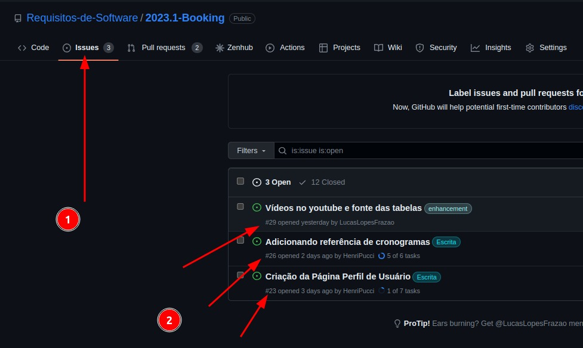

# Politica de Branch

## Criação

Para uma nova branch ser criada, deve-se seguir os seguintes passos:

- Verifique o número da issue que você criou para a branch, para isso, vá até a aba de issues no github e veja o número dela.

 Figura 1: Como encontrar o número da issue. 

Agora com o número da issue, você deve criar uma nova branch com o seguinte formato: `numeroDaIssue-nomeDaBranch`.

O nome da branch deve ser simples e direto, deve descrever o que será feito nela.

O idioma da branch deve ser o português brasileiro.

## Histórico de versões

| Versão | Data       | Descrição                            | Autor(es) | Revisor(es)    |
| ------- | ---------- | -------------------------------------- | --------- | -------------- |
| 1.0     | 21/04/2023 | Criação do documento            | Lucas  | Chaydson            |

