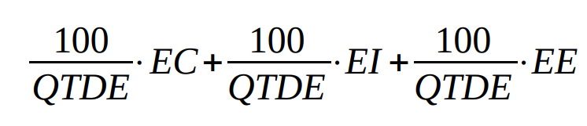

# Metodologia do resultado após a verificação e validação

## Introdução

Após a verificação e validação, o artefato deve ser avaliado novamente. O objetivo dessa avaliação é verificar se o artefato está de acordo com as exigências feitas na verificação. Caso o artefato não esteja de acordo com as exigências, o artefato deve ser ajustado e novamente avaliado. Esse processo deve ser repetido até que o artefato esteja de acordo com as exigências.

## O que foi realizado

### Tarefas

#### Perfil de usuário

- Foi ajudastado x de maneira que o artefato...
- Foi incluído x de maneira que o artefato...

#### Story Board

- Foi relido x de maneira que o artefato...
- Foi refatorado x de maneira que o artefato...
- Foi incluído x de maneira que o artefato...

#### Análise de tarefas

- Foi removido x de maneira que o artefato...
- Foi especificado x de maneira que o artefato...
- Foi feito x de maneira que o artefato...

## Resultados

Para saber a nova porcentagem de aproveitamento do artefato, será utilizado a expressão da Figura 1, no qual a Tabela 5 apresenta o significado dessa legendas.

 Figura 1: Fórmula para calcular aproveitamento (Fonte: Gabriel, 2023). 

| Acrônimo | Descrição                     |
| --------- | ------------------------------- |
| QTDE      | Quantidade Total de Exigências |
| EC        | Exigências Completas           |
| EI        | Exigências Incompletas         |
| EE        | Exigências Erradas             |

 Tabela 5: Legenda da Figura 1 (Fonte: Gabriel, 2023). 

Nos checklists realizados e que serão descritos, podemos observar que:

- y/x exigências são atendidas;
- w/x exigências estão incompletas;
- z/x exigências estão erradas ou não foram realizadas.

onde x é a quantidade de exigências.

Portanto, com base na formula apresentada, pode-se dizer que o novo aproveitamento deste artefato está em p%.

## Referências

[1] Barbosa, S. D. J.; Silva, B. S. da; Silveira, M. S.; Gasparini, I.; Darin, T.; Barbosa, G. D. J. (2021) Interação Humano-Computador e Experiência do usuário. Autopublicação. ISBN: 978-65-00-19677-1.

## Histórico de versão

|    Data    | Versão |      Descrição      | Autor(es) | Revisor(es) |
| :--------: | :-----: | :--------------------: | :-------: | :---------: |
| 17/06/2023 |   1.0   | Criação do documento |   Lucas   |   Gabriel   |
| 17/06/2023 |   1.1   | Criação da fórmula |  Gabriel  |    Lucas    |
